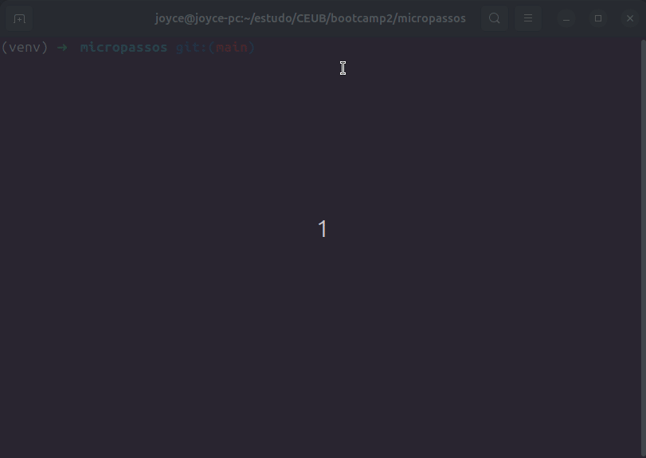

# MicroPassos




## O Problema
A sobrecarga cognitiva e a dificuldade em iniciar grandes tarefas são desafios reais, especialmente para pessoas neurodivergentes (como indivíduos com TDAH ou TEA) ou estudantes com dificuldades de organização. Aplicativos de produtividade tradicionais costumam apresentar interfaces complexas que geram ansiedade e resultam no que é conhecido como "paralisia de análise". A dor central é a falta de uma ferramenta direta para quebrar grandes objetivos em etapas menores e executáveis.

## A Solução 
O MicroPassos é uma aplicação de Linha de Comando (CLI) desenvolvida para facilitar a execução de tarefas diárias. O sistema permite registrar uma atividade principal e dividi-la em micro-passos. O foco está na conclusão individual de cada etapa, calculando o progresso automaticamente para diminuir a carga mental e fornecer um indicativo visual de avanço.

## Público-Alvo
- Estudantes com TDAH ou dificuldade de concentração;
- Pessoas neurodivergentes que necessitam de rotinas estruturadas;
- Qualquer indivíduo que sofra de procrastinação por sobrecarga de tarefas.

## Funcionalidades Principais
- Adicionar tarefas divididas em micro-passos;
- Visualizar o progresso em percentagem (%);
- Concluir micro-passos individualmente;
- Armazenamento local leve via ficheiro JSON.

## Tecnologias Utilizadas
- **Python 3** (Linguagem base)
- **JSON** (Armazenamento de dados nativo)
- **Pytest** (Testes automatizados)
- **Flake8** (Linting / Análise estática)
- **GitHub Actions** (Integração Contínua - CI)

---

## Como Instalar e Executar

1. **Clone o repositório:**
   ```bash
   git clone git@github.com:joycejdm/micropassos.git
   ```

2. **Crie e ative o ambiente virtual:**
    ```bash
    python -m venv venv
    # No Windows:
    venv\Scripts\activate
    # No Linux/Mac:
    source venv/bin/activate
   ```

3. **Instale as dependências:**
    ```bash
    pip install -r requirements.txt
   ```

4. **Execute a aplicação:**
    ```bash
    python main.py
   ```

## 🧪 Como Correr os Testes e o Linter

Este projeto utiliza ferramentas de qualidade de código. Para as executar, garanta que o ambiente virtual está ativo.

1. **Para correr os testes automatizados (Pytest):**
   ```bash
   pytest tests/
   ```

2. **Para correr a análise estática (Flake8):**
    ```bash
    flake8 src/ main.py tests/
   ```

## Versionamento

Este projeto utiliza [Versionamento Semântico](https://semver.org/).

Versão atual: 1.1.0 